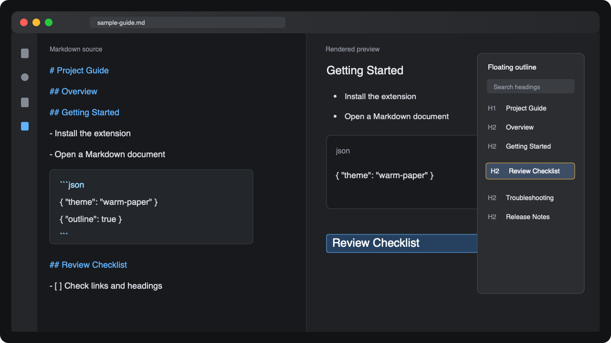
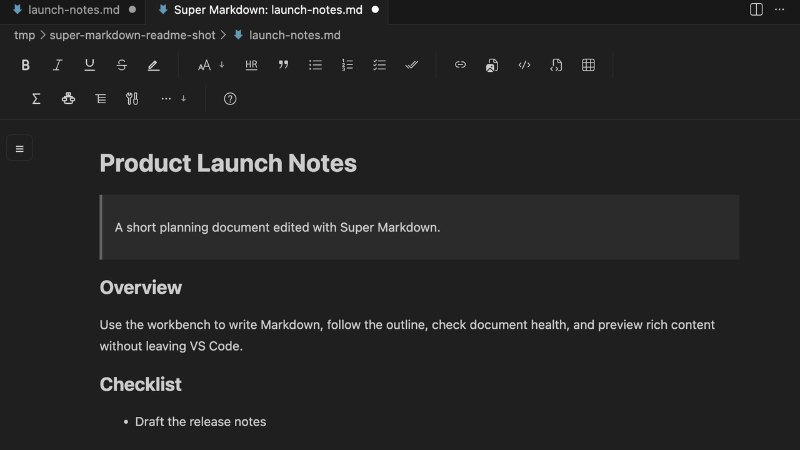

# Super Markdown

### A cleaner Markdown reading and editing experience for VS Code

English | [简体中文](#简体中文)

---

## English

Super Markdown is a VS Code extension for people who write, read, maintain, and publish Markdown: API docs, product notes, specs, guides, knowledge-base pages, and project documentation.

Markdown files now open in the Super Markdown Editor by default: a Markdown workbench with outline navigation, source editing, block-based visual editing, and live preview. You can still use `Reopen With...` or `Super Markdown: Open Native Editor` whenever you need VS Code's native text editor.

Super Markdown keeps source editing, preview, WYSIWYG editing, formatting, and export aligned around the same Markdown document, so what you write is easier to review and share.

## Screenshots

## What's New in 1.0.0

- The Markdown document library now has a calmer sidebar with a workspace tree, compact health counts, workspace summary, and focused document actions.
- Preview mode now shares the same read-only toolbar surface as split and WYSIWYG modes, so export, reading theme, language switching, and help stay in the same place.
- Export now has a dedicated toolbar button instead of being hidden behind a generic overflow menu.
- Resource directory settings are clearer: inserted or pasted images are saved to the document project's resource directory, defaulting to `assets`, with a chooser for custom paths.
- PDF and all-format export use a more reliable Chrome DevTools startup path on current Chrome, Edge, and Chromium builds.
- The built-in syntax guide and fixture documents now cover richer Markdown structures, nested resources, image workflows, and export scenarios.

## Highlights

- Open `.md`, `.markdown`, `.mdown`, and `.mkdn` files in the Super Markdown Editor by default.
- Use a Markdown workbench with outline navigation, source editing, visual block editing, and live preview.
- Switch between source, split edit, preview, and WYSIWYG modes.
- Browse workspace Markdown files from the document library sidebar and open documents directly in editor, preview, split, WYSIWYG, or native mode.
- Use WYSIWYG editing while keeping preview, formatting, and export output aligned with the Markdown source.
- Use the same export, reading theme, display language, and help toolbar controls in source, split, preview, and WYSIWYG modes.
- Format Markdown through VS Code `Format Document` with Super Markdown as the default formatter.
- Export Markdown to HTML, PDF, PNG, JPEG, or all formats.
- Keep headings, lists, tables, code, math, diagrams, preview, and export visually consistent.
- Open a built-in Super Markdown syntax guide and convert Markdown tables to JSON or JSON arrays to Markdown tables.
- Navigate long documents with a floating H1-H6 outline, heading search, active tracking, and adjustable height.
- Click preview content to reveal the matching source line; move the source cursor to scroll the preview.
- Render code blocks with built-in syntax highlighting.
- Render Mermaid diagrams and KaTeX math from bundled local assets.
- Switch the extension UI between English, Simplified Chinese, and VS Code auto mode.
- Choose from 14 reading themes, including Solarized, Rose, Lavender, Graphite, Forest, Terminal, Ink, Paper, Ocean, and High Contrast.
- Choose a workspace resource directory for images inserted or pasted into Markdown documents.
- Review safe cleanup changes in a diff before applying them.

## Quick Start

1. Install `Super Markdown` from the VS Code Marketplace or Open VSX.
2. Open a Markdown file in VS Code, Cursor, or another VS Code-compatible editor.
3. The file opens in `Super Markdown Editor` by default.
4. Use the center editor to write, the left panel to navigate and inspect health, and the right panel to preview.
5. Use `Reopen With...` or `Super Markdown: Open Native Editor` if you need VS Code's native editor.

Split Edit Mode shortcut:

- macOS: `Cmd+Alt+M`
- Windows/Linux: `Ctrl+Alt+M`

## Modes

| Mode | Best for | What it does |
| --- | --- | --- |
| `Super Markdown Editor` | Default Markdown workbench | Opens outline navigation, self-hosted editing, and live preview together. |
| `Split Edit Mode` | Writing and reviewing | Switches the Super Markdown Editor to source plus live preview. |
| `Preview Mode` | Reading | Switches the Super Markdown Editor to a focused rendered preview. |
| `WYSIWYG Mode` | Document-style writing | Switches the Super Markdown Editor to block-based visual editing while syncing back to Markdown. |

## Document Health

Document health checks are included in the Super Markdown Editor side panel and in `Super Markdown: Organize Markdown` before sharing or publishing a document.

It checks for:

- Missing H1 heading.
- Skipped heading levels.
- Stale generated table of contents.
- Duplicate heading anchors.
- Broken local links or images.
- Unchecked task count.

## Document Library

Open the Super Markdown activity bar view to browse the current workspace as a Markdown document library. It groups Markdown files by folder, keeps file rows compact, and shows health counts without turning the tree into a diagnostics panel.

The side panel also includes a workspace summary, quick actions for refreshing the index and opening the syntax guide, and an Assets section where you can choose the resource directory used for pasted or inserted images.

## Safe Cleanup

Run `Super Markdown: Organize Markdown` when you want the extension to prepare cleanup edits and a document health report. Super Markdown opens a diff first, so you can review every change before applying it.

It can help with:

- Creating or updating a generated table of contents.
- Normalizing list and task-list spacing.
- Formatting simple Markdown tables.
- Adding or updating H2-H6 section numbering when enabled.
- Running the same formatter used by VS Code `Format Document`.

## Export

Run `Super Markdown: Export PDF`, `Export HTML`, `Export PNG`, `Export JPEG`, `Export All`, or `Export (Settings)`.

Export supports headings, tables, task checkboxes, footnotes, code highlighting, Mermaid, and KaTeX. PDF and image export use your configured Chrome/Edge/Chromium path first, then a system Chrome/Edge/Chromium installation.

Export renders from the current Markdown text, so source, preview, WYSIWYG mode, and exported files stay aligned.

The editor toolbar exposes a dedicated export button in source, split, preview, and WYSIWYG modes. In preview mode the toolbar stays read-only except for actions that make sense while reading, such as export, reading theme, language switching, and help.

## Common Commands

| Command | Use it for |
| --- | --- |
| `Super Markdown: Open Editor` | Open the default three-column Markdown workbench. |
| `Super Markdown: Open Native Editor` | Reopen the file with VS Code's native text editor. |
| `Super Markdown: Split Edit Mode` | Edit source and preview side by side. |
| `Super Markdown: Preview Mode` | Open a rendered reading view. |
| `Super Markdown: WYSIWYG Mode` | Edit in the Super Markdown Editor's WYSIWYG mode. |
| `Super Markdown: Organize Markdown` | Review cleanup changes and document health. |
| `Super Markdown: Export PDF/HTML/PNG/JPEG/All` | Export the current Markdown document. |
| `Super Markdown: Open Syntax Guide` | Open the built-in Markdown syntax guide. |
| `Super Markdown: Copy Markdown Table as JSON` | Convert the selected Markdown table to JSON. |
| `Super Markdown: Copy JSON as Markdown Table` | Convert the selected JSON array to a Markdown table. |
| `Super Markdown: Switch Reading Theme` | Change the preview reading theme. |
| `Super Markdown: Switch Display Language` | Switch Super Markdown UI language. |

## Settings

Open VS Code Settings and search for `superMarkdown`.

| Setting | Description |
| --- | --- |
| `superMarkdown.preview.theme` | Preview theme: `system`, `light`, `dark`, `sage`, `paper`, `ocean`, `solarized`, `rose`, `lavender`, `graphite`, `forest`, `terminal`, `ink`, or `high-contrast`. Legacy values are migrated automatically. |
| `superMarkdown.preview.fontSize` | Base preview font size in pixels. |
| `superMarkdown.preview.maxWidth` | Maximum content width in pixels. |
| `superMarkdown.toc.levels` | Heading levels included in the outline and generated table of contents, for example `1..6` or `2..4`. |
| `superMarkdown.organize.updateTocOnSave` | Update the generated table of contents when saving Markdown files. |
| `superMarkdown.organize.numberHeadings` | Add or update H2-H6 section numbering when organizing Markdown. |
| `superMarkdown.editor.defaultMode` | Default Super Markdown Editor mode: `source`, `split`, `preview`, or `wysiwyg`. |
| `superMarkdown.format.*` | Configure formatter behavior for punctuation, tables, lists, code, and time headers. |
| `superMarkdown.wysiwyg.*` | Deprecated compatibility settings for visual editor mode, image directory, custom CSS, and editor theme. |
| `superMarkdown.export.*` | Configure export type, output directory, styles, Chromium, PDF, image, and Mermaid. |
| `superMarkdown.syntaxTools.showMessages` | Show success and failure messages for syntax tools. |
| `superMarkdown.mermaid.enabled` | Render Mermaid fenced code blocks in the preview. |
| `superMarkdown.katex.enabled` | Render KaTeX math in the preview. |
| `superMarkdown.displayLanguage` | Super Markdown UI language: `auto`, `zh-CN`, or `en`. |

## Current Limits

- Super Markdown is focused on Markdown files.
- Preview link checks are limited to local links and images that can be resolved from the current document.
- Cleanup is intentionally conservative and opens a diff before changing your document.
- PDF, PNG, and JPEG export need a usable Chrome, Edge, or Chromium executable.
- WYSIWYG mode may adjust harmless Markdown formatting details while preserving document meaning.

## Privacy

Super Markdown processes Markdown content locally in the editor and does not send your documents to a remote service by default.

## Bug Reports

Report issues here: <https://github.com/SivanCola/super-markdown/issues>

## License

Super Markdown is licensed under the Apache License, Version 2.0. See [LICENSE](LICENSE).

---

## 简体中文

Super Markdown 是一个面向 VS Code 的 Markdown 写作、阅读、整理和发布扩展，适合接口文档、产品说明、需求文档、知识库页面、项目文档和使用指南。

Markdown 文件现在会默认打开 `Super Markdown Editor`：它提供大纲导航、源码编辑、块级所见即所得编辑和实时预览。需要原生编辑器时，可以使用 `Reopen With...` 或 `Super Markdown：打开原生编辑器`。

Super Markdown 会让源码编辑、预览、所见即所得、格式化和导出围绕同一份 Markdown 文档保持一致，方便编写、检查和分享。

## 1.0.0 最新版亮点

- Markdown 文档库侧边栏更清爽：保留工作区目录树、紧凑健康计数、工作区摘要和高频文档操作，弱化问题展示的视觉压力。
- 预览模式现在也使用与分屏、所见即所得一致的只读工具栏，导出、阅读主题、界面语言和帮助入口保持在同一位置。
- 导出从通用的更多菜单中独立出来，变成明确的工具栏导出按钮。
- 资源目录设置更清晰：插入或粘贴图片时会保存到当前文档项目的资源目录，默认是 `assets`，也可以通过选择器手动指定路径。
- PDF 和全部格式导出改用更可靠的 Chrome DevTools 启动方式，适配当前 Chrome、Edge 和 Chromium。
- 内置语法速查和测试文档覆盖了更复杂的 Markdown 结构、嵌套资源、图片工作流和导出场景。

## 功能亮点

- `.md`、`.markdown`、`.mdown`、`.mkdn` 默认使用 Super Markdown Editor 打开。
- 工作台同时提供大纲导航、源码编辑、块级可视化编辑和实时预览。
- 支持源码、分屏、预览和所见即所得模式。
- 可从文档库侧边栏浏览工作区 Markdown 文件，并直接用编辑器、预览、分屏、所见即所得或原生模式打开。
- 所见即所得编辑会与 Markdown 源码、预览、格式化和导出结果保持一致。
- 源码、分屏、预览和所见即所得模式使用一致的导出、阅读主题、界面语言和帮助入口。
- VS Code `Format Document` 默认使用 Super Markdown 格式化器。
- 支持导出 HTML、PDF、PNG、JPEG 或全部格式。
- 标题、列表、表格、代码、数学公式、图表、预览和导出保持一致的显示效果。
- 内置 Super Markdown 语法速查，并提供 Markdown 表格与 JSON 互转工具。
- 用 H1-H6 悬浮大纲管理长文档，支持标题搜索、当前标题高亮和高度调整。
- 点击预览内容可定位到源码行，移动源码光标也会同步滚动预览。
- 代码块支持内置语法高亮。
- Mermaid 图表和 KaTeX 数学公式使用本地打包资源渲染。
- 扩展界面支持英文、简体中文和跟随 VS Code 自动切换。
- 提供 14 种阅读主题，包括日光、玫瑰、薰衣草、石墨、深林、终端、墨黑、纸页、海蓝和高对比等。
- 可为插入或粘贴到 Markdown 文档中的图片选择工作区资源目录。
- 整理 Markdown 前先展示 diff，确认后再应用修改。

## 快速开始

1. 从 VS Code Marketplace 或 Open VSX 安装 `Super Markdown`。
2. 在 VS Code、Cursor 或其他兼容 VS Code 的编辑器中打开 Markdown 文件。
3. 文件会默认打开 `Super Markdown Editor`。
4. 在中间编辑，在左侧导航和检查文档健康，在右侧实时预览。
5. 如需 VS Code 原生编辑器，使用 `Reopen With...` 或 `Super Markdown：打开原生编辑器`。

分屏编辑模式快捷键：

- macOS：`Cmd+Alt+M`
- Windows/Linux：`Ctrl+Alt+M`

## 编辑模式

| 模式 | 适合场景 | 作用 |
| --- | --- | --- |
| `Super Markdown Editor` | 默认 Markdown 工作台 | 同时打开大纲导航、自研编辑器和实时预览。 |
| `分屏编辑模式` | 编写和审阅 | 将 Super Markdown Editor 切换为源码加实时预览。 |
| `预览模式` | 专注阅读 | 将 Super Markdown Editor 切换为专注渲染预览。 |
| `所见即所得模式` | 文档式写作 | 将 Super Markdown Editor 切换为块级可视化编辑，并同步回 Markdown。 |

## 文档健康检查

文档健康检查已经合并到 Super Markdown Editor 侧边面板和 `Super Markdown：整理 Markdown`。分享或发布文档前，运行整理命令即可同时看到健康报告。

它会检查：

- 缺少 H1 标题。
- 标题层级跳跃。
- 生成目录已过期。
- 标题锚点重复。
- 本地链接或图片失效。
- 未完成任务数量。

## 文档库

打开 Super Markdown 活动栏视图后，可以把当前工作区作为 Markdown 文档库浏览。它按文件夹组织 Markdown 文件，文件行保持紧凑，并用轻量计数展示文档健康状态，避免把目录树变成诊断面板。

侧边栏还包含工作区摘要、刷新索引和打开语法速查等快捷操作，以及 Assets 区域。Assets 里的资源目录用于保存插入或粘贴到 Markdown 文档中的图片，默认是 `assets`，也可以手动选择项目内的其他路径。

## 安全整理

运行 `Super Markdown：整理 Markdown` 后，扩展会先生成整理结果和文档健康报告，并打开 diff。你可以检查每一处变化，再决定是否应用。

它可以帮助处理：

- 创建或更新生成目录。
- 规范列表和任务列表空格。
- 格式化简单 Markdown 表格。
- 在启用设置后添加或更新 H2-H6 章节编号。
- 复用 VS Code `Format Document` 的同一套格式化管线。

## 导出

可以运行 `Super Markdown：导出 PDF`、`导出 HTML`、`导出 PNG`、`导出 JPEG`、`导出全部格式` 或 `按设置导出`。

导出支持标题、表格、任务复选框、脚注、代码高亮、Mermaid 和 KaTeX。PDF 和图片导出优先使用你配置的 Chrome/Edge/Chromium 路径，其次查找系统 Chrome/Edge/Chromium。

导出会从当前 Markdown 文本生成，因此源码、预览、所见即所得和导出结果保持一致。

源码、分屏、预览和所见即所得模式的工具栏都会提供独立的导出按钮。预览模式中的工具栏保持只读，只保留阅读时合理的操作，例如导出、阅读主题、界面语言和帮助。

## 常用命令

| 命令 | 用途 |
| --- | --- |
| `Super Markdown：打开编辑器` | 打开默认三栏 Markdown 工作台。 |
| `Super Markdown：打开原生编辑器` | 用 VS Code 原生编辑器重新打开文件。 |
| `Super Markdown：分屏编辑模式` | 左侧编辑源码，右侧同步预览。 |
| `Super Markdown：预览模式` | 打开渲染后的阅读视图。 |
| `Super Markdown：所见即所得模式` | 在 Super Markdown Editor 内使用所见即所得模式编辑。 |
| `Super Markdown：整理 Markdown` | 预览整理改动并查看文档健康报告。 |
| `Super Markdown：导出 PDF/HTML/PNG/JPEG/全部格式` | 导出当前 Markdown 文档。 |
| `Super Markdown：打开语法速查` | 打开内置 Markdown 语法速查。 |
| `Super Markdown：复制 Markdown 表格为 JSON` | 将选中的 Markdown 表格转换为 JSON。 |
| `Super Markdown：复制 JSON 为 Markdown 表格` | 将选中的 JSON 数组转换为 Markdown 表格。 |
| `Super Markdown：切换阅读主题` | 切换预览阅读主题。 |
| `Super Markdown：切换界面语言` | 切换 Super Markdown 界面语言。 |

## 设置

打开 VS Code 设置，搜索 `superMarkdown`。

| 设置 | 说明 |
| --- | --- |
| `superMarkdown.preview.theme` | 预览主题：`system`、`light`、`dark`、`sage`、`paper`、`ocean`、`solarized`、`rose`、`lavender`、`graphite`、`forest`、`terminal`、`ink` 或 `high-contrast`。旧主题值会自动迁移。 |
| `superMarkdown.preview.fontSize` | 预览基础字号，单位为像素。 |
| `superMarkdown.preview.maxWidth` | 预览正文最大宽度，单位为像素。 |
| `superMarkdown.toc.levels` | 大纲和生成目录包含的标题级别，例如 `1..6` 或 `2..4`。 |
| `superMarkdown.organize.updateTocOnSave` | 保存 Markdown 文件时更新生成目录。 |
| `superMarkdown.organize.numberHeadings` | 整理 Markdown 时添加或更新 H2-H6 章节编号。 |
| `superMarkdown.editor.defaultMode` | Super Markdown Editor 默认模式：`source`、`split`、`preview` 或 `wysiwyg`。 |
| `superMarkdown.format.*` | 配置标点、表格、列表、代码和时间头等格式化行为。 |
| `superMarkdown.wysiwyg.*` | 为兼容保留的可视化编辑器模式、图片目录、自定义 CSS 和主题配置。 |
| `superMarkdown.export.*` | 配置导出类型、输出目录、样式、Chromium、PDF、图片和 Mermaid。 |
| `superMarkdown.syntaxTools.showMessages` | 显示语法工具成功和失败提示。 |
| `superMarkdown.mermaid.enabled` | 在预览中渲染 Mermaid 代码块。 |
| `superMarkdown.katex.enabled` | 在预览中渲染 KaTeX 数学公式。 |
| `superMarkdown.displayLanguage` | Super Markdown 界面语言：`auto`、`zh-CN` 或 `en`。 |

## 当前限制

- Super Markdown 专注于 Markdown 文件。
- 预览链接检查仅覆盖能从当前文档解析到的本地链接和图片。
- 整理功能保持保守，会先打开 diff，再修改你的文档。
- PDF、PNG 和 JPEG 导出需要可用的 Chrome、Edge 或 Chromium。
- 所见即所得模式可能调整一些不影响语义的 Markdown 格式细节。

## 隐私

Super Markdown 默认在编辑器本地处理 Markdown 内容，不会把你的文档发送到远程服务。

## Bug 反馈

- 提交地址：<https://github.com/SivanCola/super-markdown/issues>

## 许可证

Super Markdown 使用 Apache License, Version 2.0 授权。详见 [LICENSE](LICENSE)。
