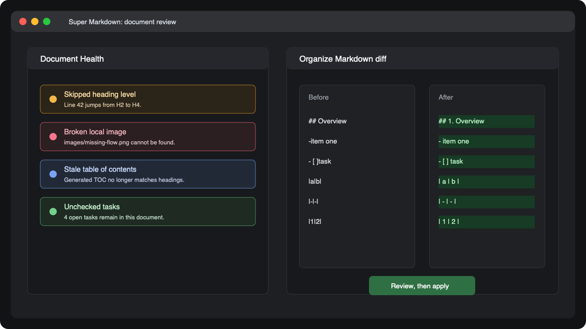

  

<h1 align="center">Super Markdown</h1>

  <strong>为 VS Code 提供更清爽的 Markdown 阅读和编辑体验。</strong>

  
  
  
  

  <a href="README.md">English</a> |
  <a href="README.zh-CN.md">中文</a> |
  <a href="CHANGELOG.md">Changelog</a>

---

## 中文

Super Markdown 是一个面向 VS Code 的 Markdown 阅读和整理扩展，适合阅读和维护较长的 Markdown 文件：接口文档、产品说明、需求文档、知识库页面、项目文档和使用指南。

它不会强制替换 VS Code 默认 Markdown 编辑器，而是在你需要更好的阅读、分屏编辑、大纲导航、文档检查和安全整理时，提供一套更完整的体验。

### 安装

在 VS Code 扩展市场中安装 Super Markdown。安装后打开任意 Markdown 文件，点击编辑器标题栏中的 `Super Markdown` 菜单即可使用。

如果你拿到的是 `.vsix` 文件，可以在命令面板中运行 `Extensions: Install from VSIX...` 进行安装。

### 快速开始

1. 打开一个 Markdown 文件。
2. 点击编辑器标题栏中的 `Super Markdown`，或在资源管理器中右键 Markdown 文件。
3. 写文档时选择 `分屏编辑模式`，阅读文档时选择 `预览模式`。
4. 使用右侧悬浮大纲搜索标题并快速跳转。

分屏编辑模式快捷键：

- macOS：`Cmd+Alt+M`
- Windows/Linux：`Ctrl+Alt+M`

### 截图

**带悬浮大纲的分屏编辑**

**文档健康检查和安全整理**

### 三种模式

| 模式 | 适合场景 | 作用 |
| --- | --- | --- |
| `分屏编辑模式` | 编写和审阅 | 左侧源码，右侧预览，支持源码和预览双向同步。 |
| `预览模式` | 专注阅读 | 打开渲染后的阅读视图，并带右侧悬浮大纲。 |
| `预览编辑器` | 可选自定义编辑器 | 通过 VS Code 的 `Open With...` 打开，不会主动替换默认 Markdown 编辑器。 |

### 亮点

- 类 Notion 的 H1-H6 悬浮大纲，支持标题搜索、当前标题高亮和高度调整。
- 点击预览内容可定位到源码行，移动源码光标也会同步滚动预览。
- 代码块支持语法高亮和一键复制。
- Mermaid 图表和 KaTeX 数学公式使用本地打包资源渲染。
- 支持在英文、简体中文和跟随 VS Code 之间切换界面语言。
- 提供多种阅读背景主题。
- 整理 Markdown 前先展示 diff，确认后再应用修改。

### 文档健康检查

运行 `Super Markdown：显示文档健康检查`，可以在分享或发布前发现常见问题：

- 缺少 H1 标题。
- 标题层级跳跃。
- 生成目录已过期。
- 标题锚点重复。
- 本地链接或图片失效。
- 未完成任务数量。

### 安全整理

运行 `Super Markdown：整理 Markdown` 后，扩展会先生成整理结果并打开 diff。你可以检查每一处变化，再决定是否应用。

它可以帮助处理：

- 创建或更新生成目录。
- 规范列表和任务列表空格。
- 格式化简单 Markdown 表格。
- 在启用设置后添加或更新 H2-H6 章节编号。

### 常用命令

| 命令 | 用途 |
| --- | --- |
| `Super Markdown：分屏编辑模式` | 左侧编辑源码，右侧同步预览。 |
| `Super Markdown：预览模式` | 打开渲染后的阅读视图。 |
| `Super Markdown：使用预览编辑器打开` | 使用可选的自定义预览编辑器打开文件。 |
| `Super Markdown：显示文档健康检查` | 检查结构、链接、锚点、目录和任务。 |
| `Super Markdown：整理 Markdown` | 预览并应用安全整理改动。 |
| `Super Markdown：切换背景主题` | 切换预览阅读主题。 |
| `Super Markdown：切换界面语言` | 切换 Super Markdown 界面语言。 |

### 设置

打开 VS Code 设置，搜索 `superMarkdown`。

| 设置 | 说明 |
| --- | --- |
| `superMarkdown.preview.theme` | 预览主题：`auto`、`light`、`dark`、`eye-care-green`、`warm-paper`、`ink-black`、`coastal-blue` 或 `high-contrast`。 |
| `superMarkdown.preview.fontSize` | 预览基础字号，单位为像素。 |
| `superMarkdown.preview.maxWidth` | 预览正文最大宽度，单位为像素。 |
| `superMarkdown.toc.levels` | 大纲和生成目录包含的标题级别，例如 `1..6` 或 `2..4`。 |
| `superMarkdown.organize.updateTocOnSave` | 保存 Markdown 文件时更新生成目录。 |
| `superMarkdown.organize.numberHeadings` | 整理 Markdown 时添加或更新 H2-H6 章节编号。 |
| `superMarkdown.mermaid.enabled` | 在预览中渲染 Mermaid 代码块。 |
| `superMarkdown.katex.enabled` | 在预览中渲染 KaTeX 数学公式。 |
| `superMarkdown.displayLanguage` | Super Markdown 界面语言：`auto`、`zh-CN` 或 `en`。 |

### 使用提示

- Super Markdown 不会强制成为默认 Markdown 编辑器。
- 如果你安装了其他 Markdown 插件，可以通过标题栏 `Super Markdown` 菜单、资源管理器右键菜单或 `Open With...` 明确选择本扩展。
- 需要更多阅读空间时，可以隐藏右侧悬浮大纲。
- 整理命令会先展示 diff，再修改文档。

### 开源协议

Super Markdown 使用 [Apache License 2.0](LICENSE) 开源。
