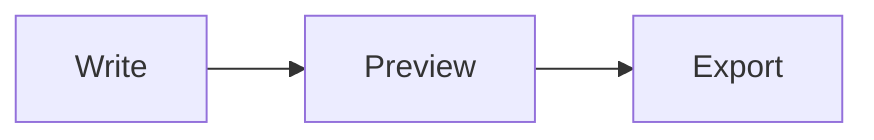

# Super Markdown Syntax Guide

Super Markdown uses its own Markdown core across source editing, split preview, WYSIWYG editing, document cleanup, and export. The syntax below is the part Super Markdown keeps aligned across preview, HTML, PDF, PNG, and JPEG output.

## Support Matrix

| Type | Syntax | Notes |
| --- | --- | --- |
| Headings | `#` through `######` | Generates GitHub-style anchors and feeds the outline and generated TOC. |
| Paragraphs | Plain text | Blank lines split paragraphs; export can turn line breaks into `<br>` with `superMarkdown.export.breaks`. |
| Blockquotes | `> quoted text` | Renders nested Markdown and GitHub-style alert blocks. |
| Lists | `-`, `+`, `*`, `1.`, `1)` | Indentation creates nested lists; indented continuation lines join the previous item. |
| Task lists | `- [ ] task`, `- [x] done` | Preview and export render disabled checkboxes; document health counts unfinished tasks. |
| Tables | Pipe tables | Supports left, center, and right alignment; the formatter aligns columns with CJK width awareness. |
| Code | ```` ```ts ```` or `~~~sh` | Supports local Shiki highlighting, copy buttons, and code block tone controls. |
| Diagrams | ```` ```mermaid ```` | Rendered with Mermaid assets bundled in the extension. |
| Math | `$...$`, `$$ ... $$` | Rendered with KaTeX assets bundled in the extension. |
| Footnotes | `[^id]`, `[^id]: note` | References link to the footnote section; missing definitions stay as source text. |
| Horizontal rules | `---`, `***`, `___` | At least 3 repeated characters, with up to 3 leading spaces. |
| Images and links | `[text](url)`, `` | Local images resolve from the current document; unsafe schemes are blocked. |

## Headings and TOC

Use ATX headings:

```markdown
# Document Title
## Section
### Subsection
```

Heading text generates anchors for the outline, preview navigation, and generated table-of-contents links. Duplicate headings get stable incremental anchors; document health warns about duplicate anchor bases.

To keep a heading out of the outline and generated TOC, add this marker on the heading line:

```markdown
## Temporary Notes <!-- omit from toc -->
```

`Super Markdown: Organize Markdown` can insert or update a table of contents wrapped by these markers:

```markdown
<!-- super-markdown-toc -->
## Table of Contents

- [Document Title](#document-title)
<!-- /super-markdown-toc -->
```

The included heading levels are controlled by `superMarkdown.toc.levels`, for example `1..6`, `2..4`, or `2`.

## Paragraphs, Blockquotes, and Alerts

Blank lines split normal paragraphs. Blockquotes continue rendering their inner Markdown:

```markdown
> This is a quote.
> It can contain **strong text**, links, and lists.
```

Super Markdown supports GitHub-style alert blockquotes:

```markdown
> [!NOTE]
> Useful context.

> [!TIP]
> Practical advice.

> [!IMPORTANT]
> Information that must be noticed.

> [!WARNING]
> Potential risk.

> [!CAUTION]
> High-risk or destructive action.
```

The supported alert types are `NOTE`, `TIP`, `IMPORTANT`, `WARNING`, and `CAUTION`.

## Lists and Tasks

Unordered lists support `-`, `+`, and `*`; ordered lists support `1.` and `1)`:

```markdown
- Top-level item
  - Nested item
    continuation line
1. First step
2. Second step
```

Task lists use `[ ]` and `[x]`:

```markdown
- [ ] To do
- [x] Done
```

The formatter can normalize list markers, task-list spacing, and ordered-list number width. Cleanup shows a diff before applying changes.

## Tables

Create tables with pipe rows and a delimiter row:

```markdown
| Name | Count | State |
| :--- | ---: | :---: |
| Apple | 12 | ok |
| Pear | 3 | check |
```

Alignment rules:

| Syntax | Alignment |
| --- | --- |
| `---` | Default |
| `:---` | Left |
| `---:` | Right |
| `:---:` | Center |

Escaped `\|` inside a cell is treated as a literal pipe, and `|` inside inline code does not split a column. `Super Markdown: Copy Markdown Table as JSON` and `Super Markdown: Copy JSON as Markdown Table` can convert selected tables and JSON arrays.

## Code Blocks

Fenced code blocks support backticks and tildes:

````markdown
```ts
const value = 1;
```

~~~sh
echo "hello"
~~~
````

Highlighted languages currently include `css`, `go`, `html`, `js`, `jsx`, `json`, `md`, `python`, `sh`, `sql`, `text`, `tsx`, `ts`, and `yaml`. Common aliases are normalized automatically, such as `typescript` -> `ts`, `javascript` -> `js`, `shell`/`bash`/`zsh` -> `sh`, `markdown` -> `md`, and `yml` -> `yaml`. Unknown languages render safely as `text`.

Code blocks in preview and HTML export include a copy button. Preview also lets you switch code blocks between auto, light, and dark tones.

## Mermaid Diagrams

Mermaid diagrams use fenced `mermaid` code blocks:

````markdown

````

`superMarkdown.mermaid.enabled` controls preview rendering; `superMarkdown.export.mermaid.enabled` controls export rendering. When disabled, Mermaid content is shown as a normal code block and the source is preserved.

## KaTeX Math

Inline math uses `$...$`:

```markdown
Mass-energy equivalence is $E = mc^2$.
```

Block math uses `$$` on its own lines:

```markdown
$$
\int_0^1 x^2 dx = \frac{1}{3}
$$
```

`superMarkdown.katex.enabled` controls preview rendering. Export includes KaTeX styles and rendered output so formulas stay readable in PDF and image output.

## Inline Formatting

| Syntax | Result |
| --- | --- |
| `` `code` `` | Inline code |
| `**bold**`, `__bold__` | Strong |
| `*em*`, `_em_` | Emphasis |
| `~~deleted~~` | Strikethrough |
| `$x + y$` | Inline math |
| `[label](https://example.com "title")` | Link |
| `` | Image |
| `<u>text</u>` | Safe underline |
| `<mark>text</mark>` | Safe highlight |
| `<kbd>Cmd</kbd>` | Keyboard style |

Link and image titles support double quotes, single quotes, and parentheses. Use angle brackets for paths with spaces:

```markdown

[API docs](./api.md 'Internal link')
[Reference](https://example.com/path(foo) (Reference title))
```

Backslashes escape common Markdown characters, such as `\*`, `\[`, and `\|`.

## Links, Images, and Safety

Relative paths, anchors, `http`, `https`, and `mailto` links are preserved. Executable or high-risk schemes such as `javascript:`, `data:`, `file:`, `command:`, and `vscode:` are replaced with `#` so preview and export do not execute untrusted content.

Local images are resolved relative to the current Markdown file. HTML export rewrites local image paths relative to the exported file; PDF, PNG, and JPEG export convert local images to file URLs for Chromium rendering.

## Footnotes

Footnote references and definitions look like this:

```markdown
Super Markdown supports footnotes[^render].

[^render]: Footnote content can contain **inline Markdown**.
```

Footnote definitions are currently parsed as single-line definitions. If a reference has no matching definition, Super Markdown leaves `[^id]` as source text instead of creating a broken link.

## Front Matter and Export

The exporter recognizes simple YAML front matter at the start of a document. `title` becomes the HTML title and exported page title:

```markdown
---
title: API Guide
---

# API Guide
```

Front matter supports simple `key: value` records, with string, number, or boolean values. The metadata block is removed from the rendered body.

## Cleanup, Formatting, and Health

`Super Markdown: Organize Markdown` creates a diff before changing the document. It can:

- Insert or update the Super Markdown table of contents.
- Normalize list, task-list, and table layout.
- Update H2-H6 section numbering when enabled.
- Run the same formatting pipeline used by VS Code `Format Document`.
- Produce a document health report.

Document health checks cover a missing H1, skipped heading levels, stale generated TOC, duplicate anchors, broken local links or images, and unfinished task count.

## Current Limits

- The Super Markdown syntax core focuses on Markdown files and does not execute arbitrary HTML or scripts.
- Safe inline HTML only preserves `<u>`, `<mark>`, and `<kbd>`; other HTML is shown as inert source or escaped.
- Footnote definitions are currently single-line.
- Code highlighting uses the built-in language set; unknown languages render as plain text.
- PDF, PNG, and JPEG export need a usable Chrome, Edge, or Chromium executable.
